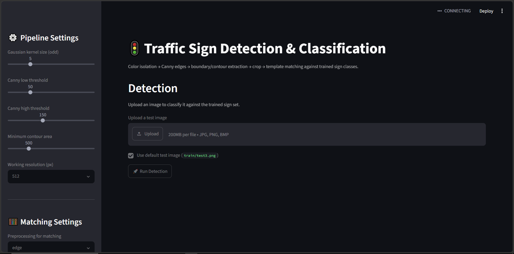
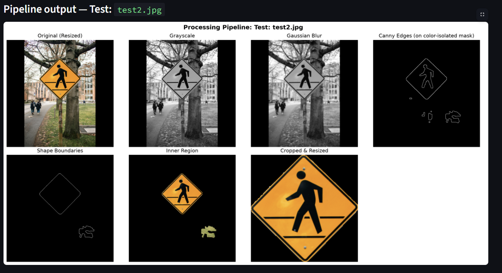
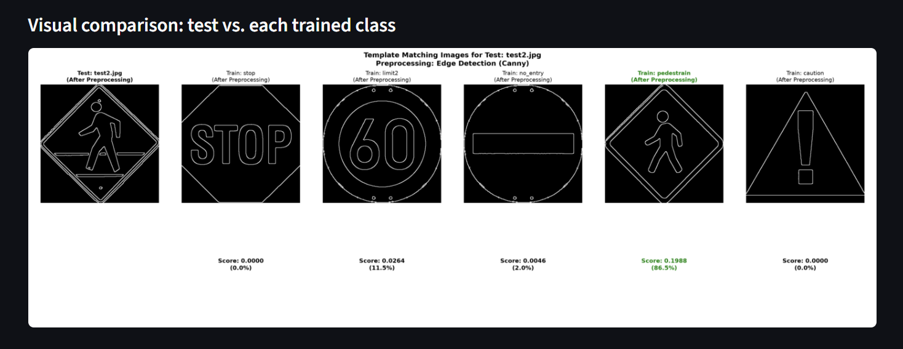
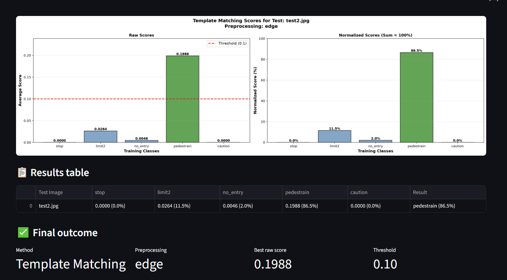

# Traffic Sign Detection and Classification System

## Overview

This project is a web-based Traffic Sign Detection and Classification System developed using Streamlit, OpenCV, NumPy, Matplotlib, and Scikit-Image.

The system detects traffic signs from uploaded images, extracts the relevant sign region using image processing techniques, and classifies the detected sign by comparing it with a set of predefined traffic sign templates.

The application provides a complete visualization of each processing stage, allowing users to observe how the input image is transformed before classification.

---

## Features

* Interactive web interface built with Streamlit
* Traffic sign detection from uploaded images
* Color-based traffic sign isolation
* Contrast enhancement using CLAHE
* Edge detection using the Canny algorithm
* Contour and boundary extraction
* Automatic sign localization and cropping
* Template matching-based classification
* Structural similarity comparison option
* Histogram matching support
* Processing pipeline visualization
* Confidence score analysis
* Classification result reporting

---


## Screenshots

### Home Page




### Image Processing Pipeline



### Classification Result


---

## System Architecture

The system follows the workflow below:

Input Image

↓

Color Isolation

↓

Contrast Enhancement (CLAHE)

↓

Noise Reduction (Gaussian Blur)

↓

Edge Detection (Canny)

↓

Contour Detection

↓

Traffic Sign Localization

↓

Cropping and Resizing

↓

Template Matching

↓

Classification Result

---

## Supported Traffic Sign Classes

The current implementation supports the following traffic signs:

| Class Name | Description            |
| ---------- | ---------------------- |
| stop       | Stop Sign              |
| limit2     | Speed Limit 60 km/h    |
| no_entry   | No Entry Sign          |
| pedestrain | Pedestrian Crossing    |
| caution    | Warning / Caution Sign |

---

## Image Processing Pipeline

### 1. Image Upload

The user uploads a traffic sign image through the web interface.

Supported image formats:

* JPG
* JPEG
* PNG
* BMP

### 2. Color Isolation

Traffic sign colors are isolated using HSV color filtering.

The system focuses on:

* Red
* Blue
* Yellow

This helps remove unnecessary background information.

### 3. Contrast Enhancement

Contrast Limited Adaptive Histogram Equalization (CLAHE) is applied to improve image visibility and highlight important sign features.

### 4. Noise Reduction

Gaussian Blur is applied to smooth the image and reduce noise before edge detection.

### 5. Edge Detection

The Canny Edge Detection algorithm extracts object boundaries from the image.

### 6. Shape Boundary Extraction

Contours are detected and filtered according to area thresholds to eliminate small unwanted objects.

### 7. Region Extraction and Cropping

The detected traffic sign region is extracted and resized to a standard resolution.

### 8. Template Matching

The processed traffic sign is compared with stored training templates using:

* Template Matching
* Edge-based Matching
* Histogram Enhanced Matching

### 9. Classification

The class with the highest similarity score is selected as the final prediction.

Confidence scores are calculated and displayed for all available classes.

---

## Project Structure

```text
Traffic-Sign-Detection/
│
├── app.py
├── README.md
├── requirements.txt
│
├── train/
│   ├── stop.jpg
│   ├── stop_2.png
│   ├── stop_3.jpg
│   ├── limit2.png
│   ├── limit2_2.jpg
│   ├── limit2_3.jpg
│   ├── nop.png
│   ├── nop_2.jpg
│   ├── nop_3.jpg
│   ├── pedes.png
│   ├── pedes_2.jpg
│   ├── pedes_3.jpg
│   ├── caution.jpg
│   ├── caution_2.jpg
│   └── caution_3.jpg
│
├── images/
│   ├── homepage.png
│   ├── pipeline.png
│   └── result.png
│
└── .gitignore
```

---

## Installation

### Clone the Repository

```bash
git clone https://github.com/yourusername/Traffic-Sign-Detection.git
cd Traffic-Sign-Detection
```

### Create a Virtual Environment

Windows:

```bash
py -3.12 -m venv venv
venv\Scripts\activate
```

Linux/macOS:

```bash
python3 -m venv venv
source venv/bin/activate
```

### Install Required Packages

```bash
pip install -r requirements.txt
```

Or install manually:

```bash
pip install streamlit
pip install opencv-python
pip install numpy
pip install pandas
pip install matplotlib
pip install scikit-image
```

---

## Running the Application

Start the application using:

```bash
python -m streamlit run app.py
```

If file watcher issues occur:

```bash
python -m streamlit run app.py --server.fileWatcherType none
```

---

## Accessing the Application

After starting the application, open the following URL in your browser:

```text
http://localhost:8501
```

---

## User Interface

### Sidebar Controls

The sidebar provides configurable parameters:

* Gaussian Kernel Size
* Canny Low Threshold
* Canny High Threshold
* Minimum Contour Area
* Working Resolution
* Template Matching Method
* Histogram Matching Option
* Structural Similarity Option
* Matching Threshold

### Main Interface

The main interface includes:

* Training Dataset Information
* Image Upload Section
* Detection Button
* Processing Pipeline Visualization
* Template Matching Results
* Score Comparison Charts
* Classification Output

---

## Experimental Results

The system provides:

* Original Image
* Grayscale Image
* Gaussian Blurred Image
* Edge Detection Output
* Boundary Extraction Output
* Cropped Traffic Sign
* Template Matching Visualization
* Confidence Score Charts
* Final Classification Result

---


## Technologies Used

* Python
* Streamlit
* OpenCV
* NumPy
* Pandas
* Matplotlib
* Scikit-Image

---

## Future Improvements

* Deep Learning-Based Classification
* YOLO-Based Traffic Sign Detection
* Real-Time Webcam Support
* Larger Traffic Sign Dataset
* Mobile Deployment
* Multi-Class Traffic Sign Recognition
* Cloud Deployment


